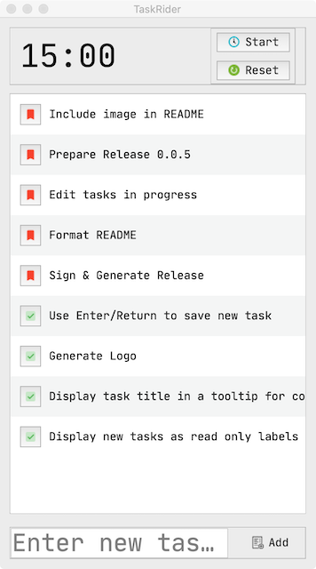

# Task Rider

Simple todo list with Pomodoro timer



### Development

You'll need Python3.6+ to run this application.

The following make commands can be used for setting up virtual env and running the application.

Setup a new virtual env in venv folder and install all the dependencies listed in requirements/dev.txt

```
$ make setup
```

Run application
```
$ make run
```

Other useful commands

```
$ make help

 Choose a command run in pyqt-boilerplate:

black                          Runs black for code formatting
clean-pyc                      remove Python file artifacts
clean                          Clean package
icns                           Generates icon files from svg
lint                           Runs Flake8 for linting
release                        Step to prepare a new release
res                            Generates and compresses resource file
run                            Runs the application
setup                          Setup virtual environment and install dependencies
uic                            Converts ui files to python
venv                           Re-initiates virtualenv
```

### Credits

🙏 https://icons8.com for Icons

🙏 https://logomakr.com/ for quickly generating logo

🙏 https://www.svgcreator.com/ for converting logo to SVG
